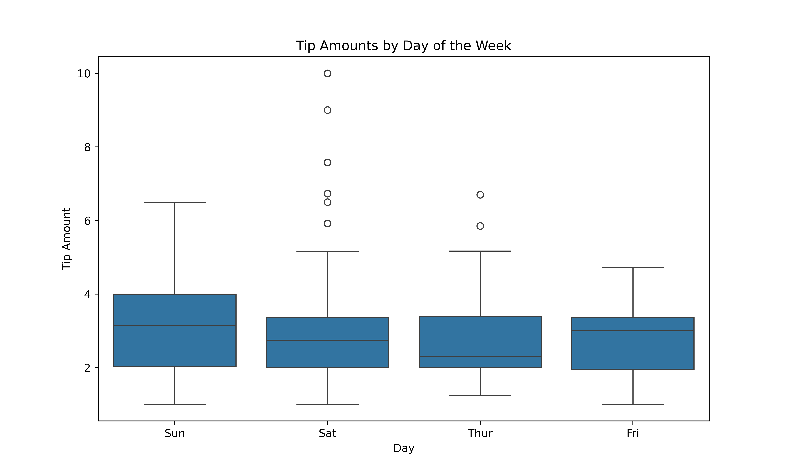
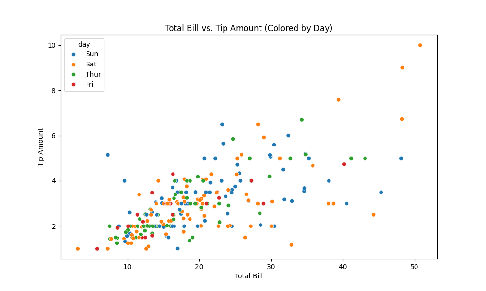

<!DOCTYPE html>
<html lang="en">
<head>
  <meta charset="UTF-8">
  <title>Tip Analysis Summary</title>
  
</head>
<body>

  <h2>Summary</h2>
  
This project analyzes tipping behavior based on a dataset of restaurant bills. It uncovers patterns and relationships between various customer attributes and tip amounts to inform better business decisions.

  <h2>1. Problem Statement</h2>
  
Tipping is vital to restaurant staff earnings, yet it can vary based on many factors. This analysis investigates what influences tip amounts—like day, time, gender, and smoker status—to help businesses optimize service strategies and better understand customer behavior.

  <h2>2. Questions Addressed</h2>
  <ul>
    <li>What are the key descriptive statistics for numerical variables?</li>
    <li>How are the categorical variables distributed?</li>
    <li>What is the relationship between total bill and tip?</li>
    <li>How do tips vary by day, time, gender, and smoking status?</li>
    <li>Is there a pattern between party size and tip amount?</li>
  </ul>

  <h2>3. Data Analysis Key Findings</h2>
  <ul>
    <li><strong>Data Cleaning:</strong> One duplicate was removed. No missing or inconsistent data types found.</li>
    <li><strong>Descriptive Stats:</strong> Average total bill = $19.81 (SD = $8.91), Average tip = $3.00 (SD = $1.39)</li>
    <li><strong>Correlation:</strong> Tip and total bill show a strong positive correlation (0.675).</li>
    <li><strong>By Day:</strong> Tips are typically higher on Saturday and Sunday.</li>
    <li><strong>By Time:</strong> Dinner tips are higher than lunch tips.</li>
    <li><strong>By Gender:</strong> Males tend to give slightly higher tips than females.</li>
    <li><strong>By Smoker Status:</strong> Minimal difference between smokers and non-smokers.</li>
    <li><strong>Party Size and Tips:</strong> Larger groups tend to give more tips, as shown in scatter plots.</li>
  </ul>

  <h3>Box Plot: Tip Distribution by Day</h3>
  
The following box plot (<code>box.png</code>) shows that weekends, especially Sunday, tend to have higher and more variable tips:

  

  <h3>Scatter Plot: Total Bill vs Tip</h3>
  
The scatter plot (<code>scatter.png</code>) illustrates a strong positive relationship between total bill and tip amount:

  

  <h2>4. Insights & Next Steps</h2>
  <ul>
    <li><strong>Outlier Detection:</strong> Investigate extreme values in tip and bill amounts for potential trends or anomalies.</li>
    <li><strong>Interaction Effects:</strong> Explore if variables like time or day interact with total bill to affect tipping.</li>
    <li><strong>Modeling:</strong> Consider regression or classification models to predict tip amounts or tipping behavior.</li>
  </ul>

</body>
</html>
